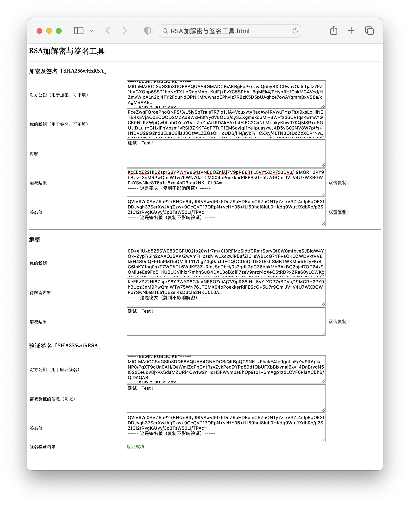

# JavaScript的RSA工具

RSA加解密与签名工具

RSA公私钥生成工具

[主页](http://tianjingli.github.io/rsa_tools/)

### 版权说明

1. RSA相关功能

   项目名称：jsencrypt

   项目地址：[https://github.com/travist/jsencrypt](https://github.com/travist/jsencrypt)

   MIT License (MIT)

2. SHA-256加密功能

   项目名称：crypto-js

   项目地址：[https://www.cdnpkg.com/crypto-js/file/crypto-js.min.js/](https://www.cdnpkg.com/crypto-js/file/crypto-js.min.js/)

3. 一键复制功能

   项目名称：clipboard.js

   项目地址：[https://clipboardjs.com](https://clipboardjs.com)

   MIT License (MIT)

### 原理图

### 效果图

